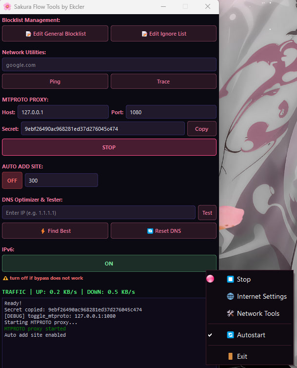

# Sakura Flow 🌸

Графический интерфейс (GUI) и менеджер автоматизации для [zapret](https://github.com/bol-van/zapret) на Windows. Приложение избавляет от необходимости вручную запускать .bat файлы и держать открытыми окна командной строки. Оно превращает скрипты обхода DPI в полноценную системную службу, которая работает в фоне, следит за сетевым трафиком и автоматически восстанавливается после сна системы.



## ✨ Основные возможности
- **Обход DPI**: Создает Windows-службу из профилей `.bat` zapret для постоянного обхода DPI
- **MTPROTO-прокси**: Встроенный мост-прокси Telegram WebSocket (127.0.0.1:1080)
- **Мульти-прокси**: Поддержка нескольких прокси с автопереключением между ними
- **Сетевые инструменты**: Ping, Tracert и монитор живого трафика (КБ/с)
- **Оптимизатор DNS**: Интеллектуальный тестер DNS (Cloudflare, Google, Yandex, Quad9) с одноразовым применением к Windows
- **Редактор блок-листа**: Редактирование доменов обхода непосредственно из приложения
- **Список исключений**: Домены, которые не будут обрабатываться обходом
- **Карантин**: Автоматическое отслеживание недоступных доменов с возможностью ручного перемещения в обход
- **Управление IPv6**: Включение/отключение IPv6 в один клик
- **Автозапуск**: Интеграция с Планировщиком задач для запуска при входе в систему
- **Обработчик сна/пробуждения**: Автоматически перезапускает службу после выхода компьютера из спящего режима
- **Автодобавление сайтов**: Мониторинг DNS-кэша браузеров и автоматическое добавление недоступных доменов

## ⚙️ Требования
- **ОС**: Windows 10/11 (64-bit)
- **Права**: Запуск от имени Администратора (необходимо для управления драйвером WinDivert и службами Windows)
- Для запуска из исходного кода: Python 3.10+

## 🚀 Быстрый старт
### 🖥️ Для пользователей (EXE)
1. Скачайте SakuraFlow.exe из раздела [Releases](https://github.com/Ekcler/Sakura-flow/releases)
2. Запустите SakuraFlow.exe
### 💻 Для разработчиков (Source)
1. Клонируйте репозиторий:
```bash
git clone https://github.com/Ekcler/Sakura-flow.git
```
2. Установите зависимости:
```bash
pip install -r requirements.txt
```
3. Запустите приложение:
```bash
python -m src.main
```

> **Примечание:** Приложению требуются привилегии администратора для управления Windows-службами. Оно автоматически запросит повышение прав, если запущено не от имени администратора.

## 📦 Сборка в один файл
Для создания автономного .exe используйте следующую команду:
```bash
pyinstaller --onedir --noconfirm --noconsole --name SakuraFlow --manifest manifest.xml --add-data "icons;icons" --add-data "zapret;zapret" --add-data "src;src" --icon=icons/moonstone.ico --version-file=version.py src/main.py
```

## ❤️ Благодарности
- **bol-van** — за создание мощного движка zapret
- **Flowseal** — за реализацию tg-ws-proxy, обеспечивающую связь с Telegram
- **NixNi** — за вдохновение и базовую логику интерфейса Sakura Flow и сетевых инструментов
