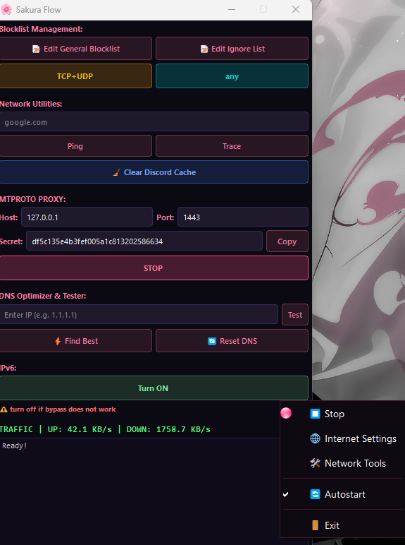

# Sakura Flow 🌸

Графический интерфейс (GUI) и менеджер автоматизации для [zapret](https://github.com/bol-van/zapret) на Windows. Приложение избавляет от необходимости вручную запускать .bat файлы и держать открытыми окна командной строки. Оно превращает скрипты обхода DPI в полноценную системную службу, которая работает в фоне, следит за сетевым трафиком и автоматически восстанавливается после сна системы.



## ✨ Основные возможности
- **Обход DPI**: Создает Windows-службу из профилей `.bat` zapret для постоянного обхода DPI
- **MTPROTO-прокси**: Встроенный мост-прокси Telegram WebSocket (127.0.0.1:1443)
- **Сетевые инструменты**: Ping, Tracert и монитор живого трафика (КБ/с)
- **DNS**: Тестер DNS (Cloudflare, Google, Yandex, Quad9) с одноразовым применением к Windows
- **Редактор блок-листа**: Редактирование доменов обхода непосредственно из приложения
- **Очистка кэша Discord**: Автоматическое закрытие Discord и удаление кэша (Cache, Code Cache, GPUCache)
- **Управление IPv6**: Включение/отключение IPv6
- **Обработчик сна/пробуждения**: Автоматически перезапускает службу после выхода компьютера из спящего режима

## ⚙️ Требования
- **ОС**: Windows 10/11 (64-bit)
- **Права**: Запуск от имени Администратора (необходимо для управления драйвером WinDivert и службами Windows)
- Для запуска из исходного кода: Python 3.10+

### 🖥️ Как запустить
1. Скачайте SakuraFlow.zip из раздела [Releases](https://github.com/Ekcler/Sakura-flow/releases)
2. Распакуйте zip в удобную папку
3. Откройте Sakuraflow.exe
4. Прочитайте инструкцию

> **Примечание:** Приложению требуются привилегии администратора для управления Windows-службами. Оно автоматически запросит повышение прав, если запущено не от имени администратора.

## 📦 Сборка в один файл
Для создания автономного .exe используйте следующую команду:
```bash
pyinstaller --onedir --noconfirm --noconsole --name SakuraFlow --manifest manifest.xml --add-data "icons;icons" --add-data "zapret;zapret" --add-data "src;src" --icon=icons/moonstone.ico --version-file=version.py src/main.py
```

## ❤️ Благодарности
- **bol-van** — за создание мощного движка zapret
- **Flowseal** — за реализацию tg-ws-proxy, обеспечивающую связь с Telegram
- **NixNi** — за вдохновение и базовую логику интерфейса Sakura Flow и сетевых инструментов
